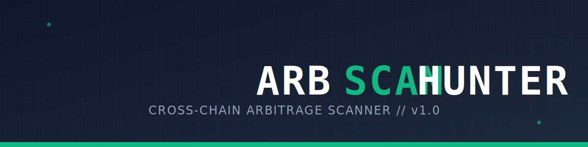

# ARBSCAN



**Version:** 1.0
**License:** MIT
**Live Tool:** [https://arbscan.ct.ws/](https://arbscan.ct.ws/) or Github Page: https://vm10k.github.io/arbitrage-scanner/

## Overview

ARBSCAN is a lightweight, client-side arbitrage scanning tool designed to identify price discrepancies for identical assets across different blockchain networks. By leveraging the DexScreener API, the application iterates through predefined lists of tokens to find pairing opportunities where a token can theoretically be bought on one chain and sold on another for a net profit.

The application operates entirely within the browser using HTML5, Vanilla JavaScript, and Tailwind CSS, requiring no backend infrastructure or API keys. It includes built-in logic to account for price impact (slippage) based on user-defined trade sizes and filters for potential liquidity traps.

## Key Features

*   **Cross-Chain Scanning:** Analyzes assets across over 80 blockchains including Ethereum, Solana, Arbitrum, Base, BSC, and Avalanche.
*   **Net Profit Calculation:** Calculates profit margins after simulating price impact based on the input trade size and available pool liquidity.
*   **Liquidity Verification:** Displays deep-dive metrics for specific pools, including base/quote token amounts and dollar-value depth.
*   **Scam & Honeypot Filtering:** Implements logic to discard pairs with extreme price spreads (>100%) or suspicious liquidity ratios to reduce false positives.
*   **Chain Filtering:** Robust inclusion (whitelist) and exclusion (blacklist) systems to target specific networks.
*   **Dual Token Lists:**
    *   **Full 19k:** A massive database of tickers for broad market scanning.
    *   **LZ/WM:** A curated list focusing on LayerZero and Wormhole bridged assets.
*   **Responsive UI:** A fully responsive interface supporting both desktop and mobile layouts with a toggleable dark/light theme.

## Prerequisites

*   A modern web browser (Chrome, Firefox, Edge, Safari, or Brave).
*   An active internet connection to query the DexScreener API.

## Installation and Setup

This application is designed to run without a build process or server environment.

### Option 1: Use Live Version
Access the hosted tool directly here: [https://arbscan.ct.ws/](https://arbscan.ct.ws/)

### Option 2: Local Deployment
1.  **Download the Source:** Clone this repository or download the `index.html` file.
2.  **Launch:** Double-click `index.html` to open it in your default web browser.

## Usage Guide

### 1. Configuration
Before starting the scanner, configure the parameters in the top control bar:

*   **Token List:** Select "FULL 19K" for broad discovery or "LZ/WM" for specific bridge-related tokens.
*   **Trade Size ($):** Input your intended capital (e.g., 200). The scanner uses this to calculate price impact. Larger sizes will result in higher impact and lower net spreads.
*   **Chain Filter:** Click "Filter Chains" to open the modal. Use the "Include" tab to scan only specific chains, or "Exclude" to ignore chains you do not wish to bridge to.
*   **Min Liq:** Set a minimum liquidity threshold (USD) to filter out low-volume dust pools.

### 2. Scanning
Click the **START SCANNER** button. The application will begin iterating through the selected token list. The "Live Feed" sidebar (desktop only) will display system logs and status updates.

### 3. Interpreting Results
Cards will appear in the main grid as opportunities are found. Each card displays:
*   **Token Symbol:** The asset ticker.
*   **Net Profit:** The calculated percentage profit after price impact.
*   **Routes:** The source chain (Buy Low) and destination chain (Sell High).
*   **Prices:** The specific price on both chains.

### 4. Deep Dive Analysis
Clicking on any result card opens the "Deep Dive" view (sidebar on desktop, slide-over on mobile). This view provides:
*   **Pool Addresses:** Contract addresses for verification.
*   **Dex ID:** The specific decentralized exchange hosting the liquidity.
*   **Pool Composition:** Exact amounts of Base and Quote tokens in the pool.
*   **Direct Links:** External links to view the pair on DexScreener.

## Algorithm and Safety Logic

The scanner employs several safety checks to ensure result quality:

1.  **Asset Matching:** It verifies that the base token names match (normalized) to ensure the scanner is comparing the same asset, not just the same ticker symbol.
2.  **Impact Analysis:** Profit is not calculated on spot price alone. It simulates the buy and sell pressure against the constant product formula (x * y = k) to derive a "Net Profit."
3.  **Liquidity Ratio Check:** If the liquidity on one chain is significantly larger (>50x) than the other, the result is discarded to prevent matching legitimate high-cap tokens with low-cap scam tokens sharing the same name.
4.  **Spread Cap:** Arbitrage opportunities exceeding 100% or below 0.5% are filtered out to reduce noise and obvious honeypots.

## Support the Creator

Development and maintenance of this open-source tool are supported by community contributions. If you find this software useful for your research or trading, please consider supporting the creator.

**EVM Address (ETH / BSC / ARB / OP / BASE):**
```text
0x22f9790175ef4f549092c91123e0f7c339cc7d3d
```
Disclaimer
This software is for educational and research purposes only.
Risk: Cryptocurrency trading involves high risk.
Accuracy: Data is fetched from third-party APIs and may be subject to latency.
Verification: Always verify contract addresses on block explorers before interacting with any smart contract. The tool does not guarantee that tokens are bridgeable or that the liquidity is not locked/malicious.

Credits
Developed by vm10k.
UI built with Tailwind CSS.
Data provided by DexScreener API.
